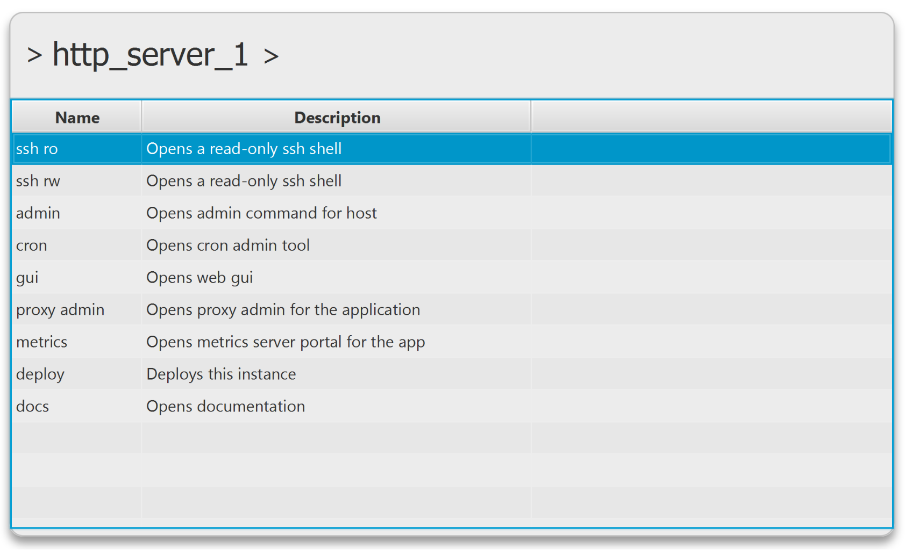

# Introduction
Tabular is a free-text searchable table based command launcher.

## Managing Infrastructure
It was primarily built as a way of managing a large number of deployed applications across many environments.  

It allows a free-text based search across hosts, instances, environments application types, etc.

Once a host/instance has been selected, a list of preconfigured commands is displayed and can be searched across,
and executed.

## Other uses
Tabular is totally agnostic to the data it is given! 

Although it was built for managing infrastructure,
it can provide for free text searching across any sort of data, and provide a list of configured commands
to execute using that data

# Three step search and execute
## Launch Tabular
Tabular is launched via pre-configured hot-keys.  Once launched, a prompt is displayed.


## Search Data
The user can then use free-text based searching across the CSV dataset provided to tabular on startup.

The user can then select a row to execute a command on.  (Or ESC to hide tabular again.)


## Search Command and Execute

After a row is selected, a set of configured commands are displayed.  The user can search
across these commands, and execute a chosen command (or ESC to return back to the data table search.)



# Setup
1. Ensure you have a version of a Java greater than or equal to Java 8.
2. Download the latest version of the Tabular zip from [here](dist), and unzip
   into your directory of choice.
3. Edit the table.csv and config.properties as per your requirements. Please see the examples and config reference below for
some guidance.
4. Run the jar file. Depending on your OS, just double click the jar and the application should launch.
   If this does not work, you can run: `java -jar tabular.jar` in the directory where the jar file
   is located.

# Configuration reference
## General properties
| property                                           | description                                                                                                                                                                                                                                        |
|----------------------------------------------------|----------------------------------------------------------------------------------------------------------------------------------------------------------------------------------------------------------------------------------------------------|
| hotkey_combinations_show                           | Comma delimited list of hotkey combinations which can then be used to restore Tabular from a minimized state.  The format of these strings should be of the format used by the awt KeyStroke.getKeyStroke(String) method. See below for more info. |
| data_search_background_prompt_text                 | Prompt to display when searching for data                                                                                                                                                                                                          |
| command_search_background_prompt_text              | Prompt to display when searching for command                                                                                                                                                                                                       |
| columns_to_display_in_data_table                   | A comma separated list of column names to show in the table.  Useful for specifying default column ordering.  Can also be used to hide columns which you don't want to show, i.e. which might just be used to reference to from other cells.       |
| columns_to_index_in_data_table                     | A comma seperated list of columns names to index.  If property is not given, then all columns are indexed.                                                                                                                                         |
| columns_to_display_in_command_table                | Can be used to specify which columns to show in the command table, and in what order.  Options are: Name & Description.                                                                                                                            |
| columns_to_index_in_command_table                  | A comma seperated list of columns names to index.  Options are: Name & Description.  If property is not given, then both columns are indexed.                                                                                                      |
| data_expression_to_display_when_selected           | When a data column is selected, this Freemarker expression will be used to create a prefix in the main prompt box when a row is selected.                                                                                                          |
| command_expression_to_display_when_selected        | When a command is selected, this Freemarker expression will be used to create a prefix in the main prompt box.  Defaults to 'command.name'.                                                                                                        |
| close_console_on_command_finish                    | Close Tabular once the command has finished running. Defaults to true.                                                                                                                                                                             |
| skip_command_browse_if_only_one_command_configured | Defaults to false.                                                                                                                                                                                                                                 |

# Command definitions
## Using properties or xml to define commands
Command definitions can be defined in the older deprecated method of using properties.  Or by using the preferred method 
of defining commands in an xml file.  The disadvantage of using properties to define commands is that the predicate (the
expression to decide if a command is valid for a row) is run as a groovy expression. Executing thousands of groovy 
(one-per-row-per-command) can take time.  The xml predicates are translated to pure java and run much faster.

## Expressions
Command expressions are compiled using [Freemarker](https://freemarker.apache.org/docs/ref_builtins_alphaidx.html).  Within your expression, you can use variables from:
* Columns from the current row.
* Properties defined within config.properties
* Properties defined within config-local.properties (if it exists)
* Any system properties
* Any environment variables

## Command definitions using properties (deprecated)
This method of configuring commands is fine when working with a small number of data rows, against a small number of commands.
If you wish to work with a large dataset (e.g. > 500) against a large number of commands (e.g. > 20) then commands configured
via XML is preferred as startup of Tabular will be much quicker.

|property |description |
|---|---|
| app.commands.[commandName].name |Human readable name for the command. |
| app.commands.[commandName].predicate |The predicate to use for whether the command is available for a certain data row. The value can be any valid groovy code. Any cell values, System Variables, Environment Variables can be referenced using the ${myVar} notation. See examples below under `app.commmands.startApplication.predicate` which checks to see that the environment is not prod. If no predicate is specified, then the command will always be displayed. |
| app.commands.[commandName].command |The command to run.  Again any cell values, System Variables, Environment Variables can be referenced using the ${myVar} notation.  Also embedded groovy can be used to calcuate dynamic values using {{[groovy to execute}} syntax.  See example below whiich gets yesterdays date. |
| app.commands.[commandName].description |Human readable description for the command. |


### Properties config example including commands
```properties
hotkey_combinations_show=shift ctrl PLUS

data_expression_to_display_when_selected=${App}
command_expression_to_display_when_selected=${Name}

data_search_background_prompt_text=App Search
command_search_background_prompt_text=Command Search

app.commmands.openLog.name=display logs
app.commmands.openLog.predicate=true
app.commmands.openLog.command="C:\\Program Files\\Mozilla Firefox\\firefox.exe" http://${Host}:8080?from={{java.time.LocalDate.now().minusDays(1).toString()}}
app.commmands.openLog.description=Display logs in browser since yesterday

app.commmands.cmder.name=ssh to box
app.commmands.cmder.predicate=true
app.commmands.cmder.command=${CMDER_HOME}/cmder.bat ${Host} "ls -al"
app.commmands.cmder.description=ssh to  host name
```

## Command definitions using xml
### Properties config example including commands
#### config.properties
```properties
hotkey_combinations_show=shift ctrl PLUS

data_expression_to_display_when_selected=${instance}

command_xml_file=commands.xml
app.columns.to.display.in.data.table=app,instance,host,region,env,dc
app.columns.to.display.in.command.table=Name,Description
app.data.search.background.prompt.text=Search Infrastructure
```
#### commands.xml
```xml
<commands>
  <command id='ssh_ro' name='ssh ro' description='Opens a read-only ssh shell' command_line='dummycommand ${host}'/>
  <command id='ssh_rw' name='ssh rw' description='Opens a read-only ssh shell' command_line='dummycommand ${host}'/>
  <command id='admin' name='admin' description='Opens admin command for host' command_line='dummycommand ${host}'/>
  <command id='cron' name='cron' description='Opens cron admin tool' command_line='dummycommand ${host} ${instance}'/>
  <command id='gui' name='gui' description='Opens web gui' command_line='dummycommand ${host}'>
    <condition><equals col_name='app' value='http_server'/></condition>        
  </command>        
  <command id='proxy_admin' name='proxy admin' description='Opens proxy admin for the application' command_line='dummycommand ${host} ${instance}'>
    <condition><equals col_name='app' value='http_server'/></condition>        
  </command>
  <command id='metrics' name='metrics' description='Opens metrics server portal for the app' command_line='dummycommand ${host} ${instance}'/>
  <command id='deploy' name='deploy' description='Deploys this instance' command_line='dummycommand ${host} ${instance}'>
    <not><equals col_name='env' value='prod'/></not>            
  </command>
  <command id='docs' name='docs' description='Opens documentation' command_line='dummycommand ${host} ${instance}'/>
</commands>
```
### Conditional predicates
If no ```condition``` tag is specified within a command definition, then the command 
will be available for _every_ row.  If the ```condition``` tag is displayed, one or 
more of the following logic tags can be used.

#### equals
Checks the value of a column
```xml
<equals col_name="env" value="prod"/>
```

#### matches
Matches against the value of a column using regex (Java regex syntax is used.)
```xml
<matches col_name="host" regex=".*?tools4j.org"/>
```

#### greater_than_or_equal_to
Checks if the numeric value of a cell in the row is greater than or equal
to a given value.  The value can be a whole or decimal number.
```xml
<greater_than_or_equal_to col_name='price' value='6'/>
```

#### less_than_or_equal_to
Checks if the numeric value of a cell in the row is less than or equal
to a given value.  The value can be a whole or decimal number.
```xml
<less_than_or_equal_to col_name='price' value='3.2'/>
```

#### greater_than
Checks if the numeric value of a cell in the row is greater than a given 
value.  The value can be a whole or decimal number.
```xml
<greater_than col_name='price' value='6'/>
```

#### less_than
Checks if the numeric value of a cell in the row is less than a given 
value.  The value can be a whole or decimal number.
```xml
<less_than col_name='price' value='6'/>
```

#### and
A 'parent' tag, resolves to true if _all_ of the child tags resolve to true.
```xml
<and>
   <matches col_name='host' regex='.*?tools4j.org'/>
   <greater_than_or_equal_to col_name='price' value='3'/>
   <less_than col_name='price' value='6'/>
</and>
```

#### or
A 'parent' tag, resolves to true if _any_ of the child tags resolve to true.
```xml
<or>
   <matches col_name='host' regex='.*?tools4j.org'/>
   <greater_than col_name='price' value='400.25'/>
</or>
```

#### not
A 'parent' tag that can only have a single child, resolves to true if it's child resolves to false.
```xml
<not>
   <matches col_name='host' regex='.*?tools4j.org'/>
</not>
```

## CSV file format
The CSV parsing is done using OpenCSV.  Please see the [documentation](http://opencsv.sourceforge.net/) for more details.
Variable substition can be used within the csv cell values.  Variables should be specified with a preceding ${ and a trailing }. e.g. ${myVar}.  Variables can be defined in the config.properties file.  Other cell values in the same row can also be referenced simply by using the column name.  Environment and System variables can also be referenced.

## Per-user properties
One way of distributing Tabular amongst a team is to check-in the Tabular distribution, along with your table.csv and config.properties into a Version Control System e.g. Git/SVN.  If users wish to configure any config overrides, they can create a 'config-local.properties' and add any config overrides there.  Be sure to add the file to the appropriate ignore file is not accidentally added to your VCS.

## Config resolution
There are three files which Tabular uses.
* Config propperties (default file-name config.properties)
* Local config properties (default file-name config-local.properties)
* CSV file containnig table (default file-name table.csv)

Each of these three config files are resolved (separately) in the following order:
* URL system property/env variable.  This can contain a comma separated list of URLs.  
* File path system property/env variable. This can contain a single relative or absolute path to a file.
* Directory path system property/env variable.  This can contain a single relative or absolute path to a directory. Default filenames are looked for.
* User directory.  This is located at (user-home)/.tabular  Default filenames are looked for.
* Working directory. (From where you launched tabular).  Default filenames are looked for.

Note:
* If using URLs, more than one URL can be specified.  If more than one URL is specified, then config files are combined.  CSV files are also combined.  CSV files must have the same column headings.
* Upper-case, or lower-case system properties / env variables can be used.  If both a system property and an environment variable is set, the system property takes precedence.

System properties / env variables are below.  

|property |system property / env var |
|---|---|
|Config properties file URL(s) |tabular_config_file_url |
|Config local properties file URL(s) |tabular_local_config_file_url |
|CSV table file URL(s) |tabular_csv_url |
|Config properties file path |tabular_config_file_path |
|Config local properties file path |tabular_local_config_file_path |
|CSV table file path |tabular_csv_path |
|Config directory path |tabular_config_dir |

## Troubleshooting
* If you get an exception which looks like this: `Exception in thread "main" java.lang.UnsupportedClassVersionError: org/tools4j/tabular/javafx/Main : Unsupported major.minor version 52.0`, this probably means that you are using a version of Java < Java8.  Check your Java version by running `java -version`.

## Valid values for the 'hotkey.combinations.show' property
You must use values accepted by javax.swing.Keystroke.getKeyStroke() method.  You can find the docs here: https://docs.oracle.com/javase/7/docs/api/javax/swing/KeyStroke.html#getKeyStroke(java.lang.String)
Here are some examples:
```
INSERT
control DELETE
alt shift X
alt shift released X
typed a
```
### Capturing keystrokes to get a value for hotkey.combinations.show
To 'capture' a keystroke combination to use within Tabular, you can run the jkeymaster 'key grabber' application.  You can start it by running something like this on the command line:
```
java -cp lib/jkeymaster-1.3.jar com.tulskiy.keymaster.AWTTest
```
(jkeymaster jar is distributed with Tabular)
If you're running on Windows, I've provided a key-grabber.bat file in the distribution which you can use.
It will create a small window, with a small edit box which you can click into, and enter your keystrokes of choice.  The keystrokes are printed out in the format required to configure Tabular's hotkey.
