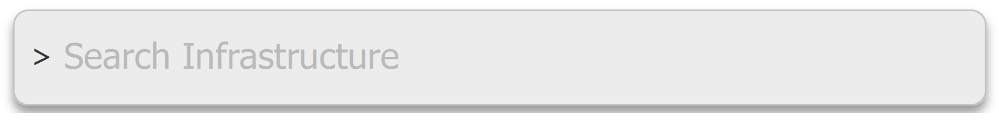
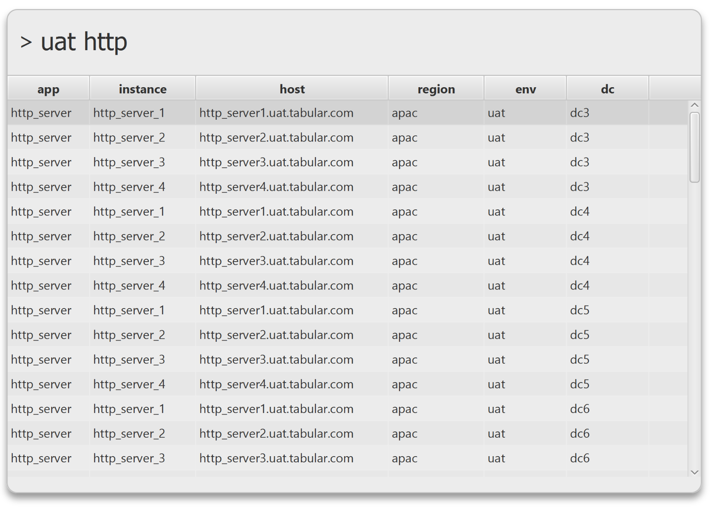

# Tabular
## Introduction
Tabular is a GUI providing searching of a static table of data, with the
option of launching commands from selected rows.



You provide the data via a CSV file, and configure the rules for viewing
and searching the data via a properties file. There is also the option
of launching commands from the data of a selected row.



## Setup

1. Ensure you have a version of a Java greater than or equal to Java 8.
2. Download the latest version of the Tabular zip from [here](dist), and unzip
   into your directory of choice.
3. Edit the table.csv and config.properties as per your requirements. Please see the examples and config reference below for
some guidance.
4. Run the jar file. Depending on your OS, just double click the jar and the application should launch.
   If this does not work, you can run: `java -jar tabular.jar` in the directory where the jar file
   is located.

## Usage
There are 3 ways that Tabular can be used.
1. To search across a table of data.  [See example.](src/test/resources/simple_table)
2. To search across a table of data, select a row, and run a command using data from that row. [See example.](src/test/resources/table_with_single_command)
3. To search across a table of data, select a row, search for an appropriate command, select a command to run. [See example.](src/test/resources/table_with_multiple_commands)

## Configuration reference
### General properties
|property |description |
|---|---|
| hotkey.combinations.show | comma delimited list of hotkey combinations which can then be used to restore Tabular from a minimized state.  The format of these strings should be of the format used by the awt KeyStroke.getKeyStroke(String) method. See below for more info. |
| app.csv.delimiter | allows you to specify the delimiter to use in the table.csv file.  By default this is a comma ',' |
| app.csv.escapedCharacterQuote | allows you to specify a custom escape character when you want to include the delimiter in your cell text.  By default this is a double quote ".  See [OpenCSV Documentation](http://opencsv.sourceforge.net/) for more info. |
| app.columns.to.display.in.data.table | A comma separated list of column names to show in the table.  Useful for specifying default column ordering.  Can also be used to hide columns which you don't want to show, i.e. which might just be used to reference to from other cells. |
| app.column.abbreviations.<ColumnName> | Can be used to specify abbreviations for column names.  e.g. `app.column.abbreviations.Host=h` Can make for more concise variable names. |
### Properties relevant when using commands
|property |description |
|---|---|
| app.columns.to.display.in.command.table |  Can be used to dictate which columns to show in the command table, and in what order.  Options are: Name & Description. |
| app.data.column.to.display.when.selected | Dictates the column to display in the main prompt box when a row is selected. |
| app.command.column.to.display.when.selected | The column to display in the main prompt box when a command is selected to run. Defaults to 'Name'. |
| app.close.console.on.command.finish | Close Tabular once the command has finished running. Defaults to false. |
| app.skip.command.browse.if.only.one.command.configured |  Defaults to false. |
### Command definitions
|property |description |
|---|---|
| app.commmands.<commandName>.name |Human readable name for the command. |
| app.commmands.<commandName>.predicate |The predicate to use for whether the command is available for a certain data row. The value can be any valid groovy code. Any cell values, System Variables, Environment Variables can be referenced using the ${myVar} notation. See examples below under `app.commmands.startApplication.predicate` which checks to see that the environment is not prod. If no predicate is specified, then the command will always be displayed. |
| app.commmands.<commandName>.command |The command to run.  Again any cell values, System Variables, Environment Variables can be referenced using the ${myVar} notation. |
| app.commmands.<commandName>.description |Human readable description for the command. |

#### Command definition examples
```
app.commmands.displayInStockControl.name=Display in stock control
app.commmands.displayInStockControl.predicate=true
app.commmands.displayInStockControl.command=../stock-control-app.exe --show ${Id}
app.commmands.displayInStockControl.description=Opens up the selected item in the stock control application

app.commmands.displayInWebsite.name=Display on website
app.commmands.displayInWebsite.predicate=true
app.commmands.displayInWebsite.command=firefox.exe 'http://www.acmeclothing.co.uk/item/${Id}'
app.commmands.displayInWebsite.description=Open the item in a browser

app.commmands.orderLowStock.name=Order for low stock
app.commmands.orderLowStock.predicate=${NumInStock} <= 5
app.commmands.orderLowStock.command=./stock-control-app.exe --order ${Id}
app.commmands.orderLowStock.description=Places order for items which are low in stock
```

## CSV file format
The CSV parsing is done using OpenCSV.  Please see the [documentation](http://opencsv.sourceforge.net/) for more details.
Variable substition can be used within the csv cell values.  Variables should be specified with a preceding ${ and a trailing }. e.g. ${myVar}.  Variables can be defined in the config.properties file.  Other cell values in the same row can also be referenced simply by using the column name.  Environment and System variables can also be referenced.

## Per-user properties
One way of distributing Tabular amongst a team is to check-in the Tabular distribution, along with your table.csv and config.properties into a Version Control System e.g. Git/SVN.  If users wish to configure any config overrides, they can create a 'config-local.properties' and add any config overrides there.  Be sure to add the file to the appropriate ignore file is not accidentally added to your VCS.

## Troubleshooting
* If you get an exception which looks like this: `Exception in thread "main" java.lang.UnsupportedClassVersionError: org/tools4j/tabular/javafx/Main : Unsupported major.minor version 52.0`, this probably means that you are using a version of Java < Java8.  Check your Java version by running `java -version`.

## Valid values for the 'hotkey.combinations.show' property
You must use values accepted by javax.swing.Keystroke.getKeyStroke() method.  You can find the docs here: https://docs.oracle.com/javase/7/docs/api/javax/swing/KeyStroke.html#getKeyStroke(java.lang.String)
Here are some examples:
```
INSERT
control DELETE
alt shift X
alt shift released X
typed a
```
### Capturing keystrokes
To 'capture' a keystroke combination to use within Tabular, you can run the jkeymaster 'key grabber' application.  You can start it by running something like this on the command line:
```
java -cp lib/jkeymaster-1.2.jar com.tulskiy.keymaster.AWTTest
```
(jkeymaster jar is distributed with Tabular)
If you're running on Windows, I've provided a key-grabber.bat file in the distribution which you can use.
It will create a small window, with a small edit box which you can click into, and enter your keystrokes of choice.  The keystrokes are printed out in the format required to configure Tabular's hotkey.

## Acknowledgements
- jkeymaster is used to provide hotkey support.  https://github.com/tulskiy/jkeymaster
- OpenCSV is used to parse the table.csv file: http://opencsv.sourceforge.net/
